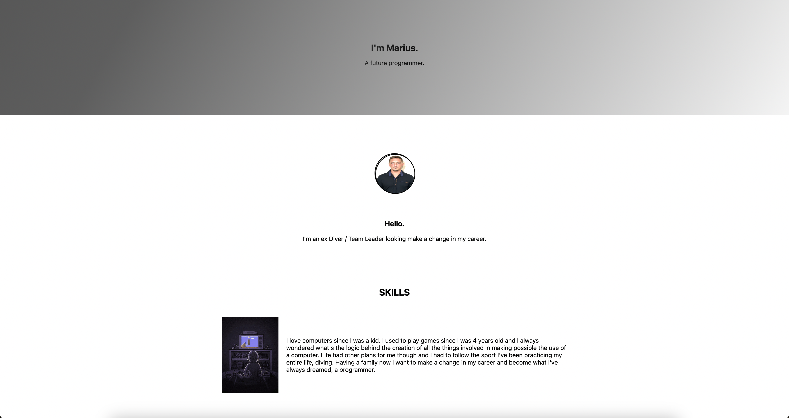

# Basic Portfolio


[](#)


> A simple portfolio website showcasing an introduction, skills, and contact information.

## Overview
Basic Portfolio is one of the first portfolio websites created as a learning project in web development. It features a minimalistic design with sections dedicated to introducing the user, highlighting skills, and providing contact options. The project is designed with a clean structure, making it an excellent starting point for beginners.

## Preview

<p align="center">
  
</p>

## Features
- **Introduction Section:** Displays name, role, and career aspirations. 
- **Skills Section:** Briefly outlines key interests and technical skills. 
- **Contact Section:** Provides an easy way to get in touch. 
- **Minimalistic Design:** Clean and simple layout for a structured presentation. 
- **Fully Responsive:** Adapts to different screen sizes for a seamless experience.


## Live Demo
**Explore the live version here:** [View Live Demo](https://marius-bogdan.com/projects/basic-portfolio/)

## Local Setup
1. **Clone** the repository:
   ```bash
   git clone https://github.com/MIBogdan/basic-portfolio.git
   ```
2. **Open** the `index.html` file in your browser
   *- or use a local development server (like VS Code Live Server) for a smoother development experience.*


---

## Author
**Marius Bogdan**  
[Personal portfolio](https://marius-bogdan.com/)

Feel free to reach out for any questions or collaborations!

## License

This project is provided for testing and demonstration purposes only. All rights are reserved. No part of this project may be redistributed, reuploaded, or used in any manner (commercially or otherwise) without explicit written permission from the author.

